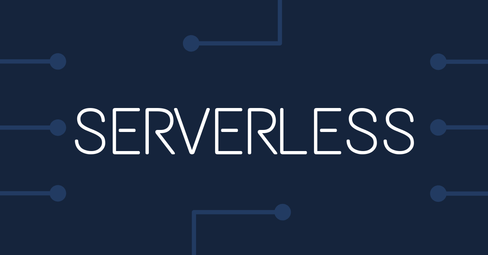

## A new serveress perspective

### 

There was much semantics for us to decide if we need to move to a better, more scalable architecture.

Last winters I was first introduced with Azure Functions. Functions bring significant potential to your application with its various invocation strategies. But for a workflow-driven application, it's advantages are unparalleled.

_If you are not familiar with Azure Functions I would suggest you read [this article](https://medium.com/grapecity/an-introduction-to-azure-functions-845fbf0033af)._

> ⚡ Functions ⚡

> Functions let you run your code as a 'function' in some computer and this 'function' could start in various fashions like:
> - adding an item in Blob Storage, Queue storage or Cosmos DB,
> - message queueing via Event Grid, Event Hubs, Microsoft Graph Events, Service Bus and 
> - via HTTP/Webhooks and Timers
> You can pass the result of your function into most of the azure pipelines. 

### Here are some of the biggest takeaways from Functions:

 - Functions can be invoked from any external event source. No integration is required.
 - Functions are load balanced.
 - With proper IoC implementation, any operation in Functions can execute parallelly with windows service.
 - Since functions are essentially stateless, a storage queue can be used to maintain 'state' over a long-running task (ex: Durable Function).
 - Functions which throws an unhandled error, update dequeue counter of the triggering queue item. Thus, for transient errors, poison queue items can be processed separately.
